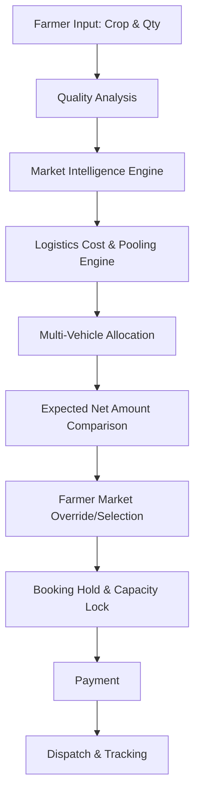
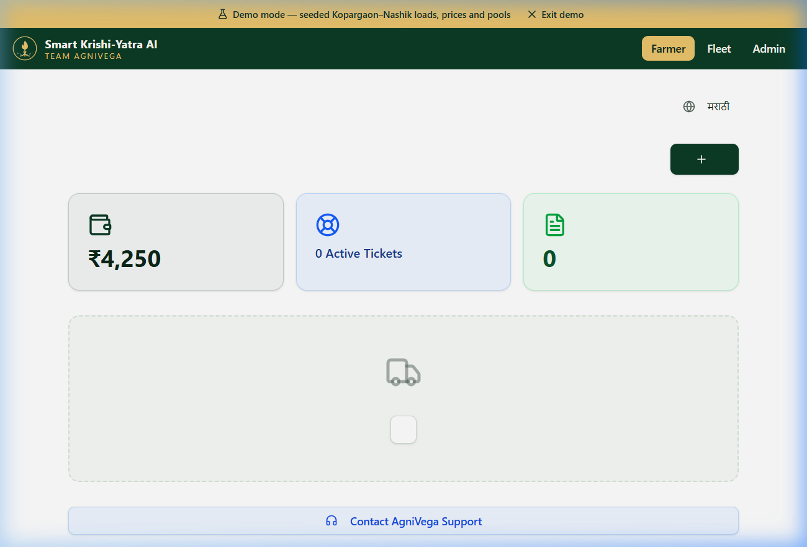
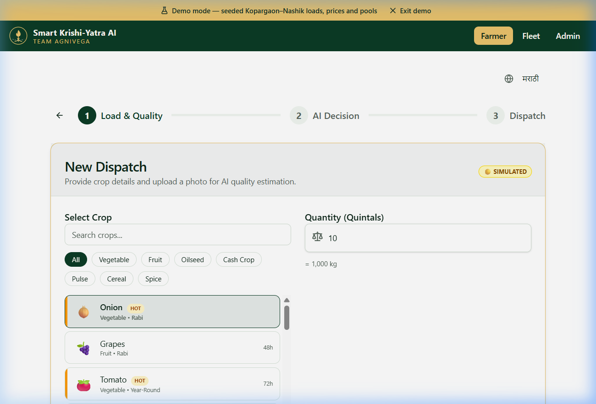
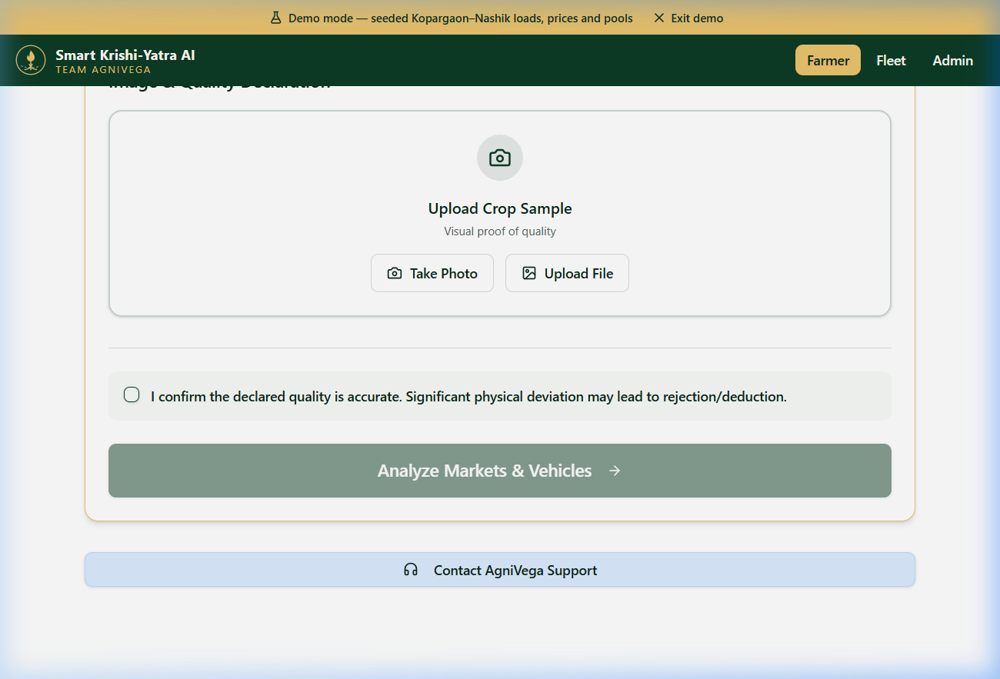
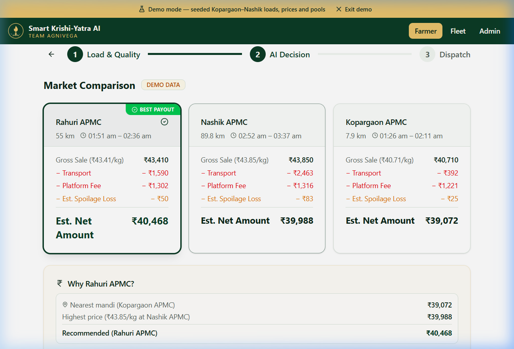
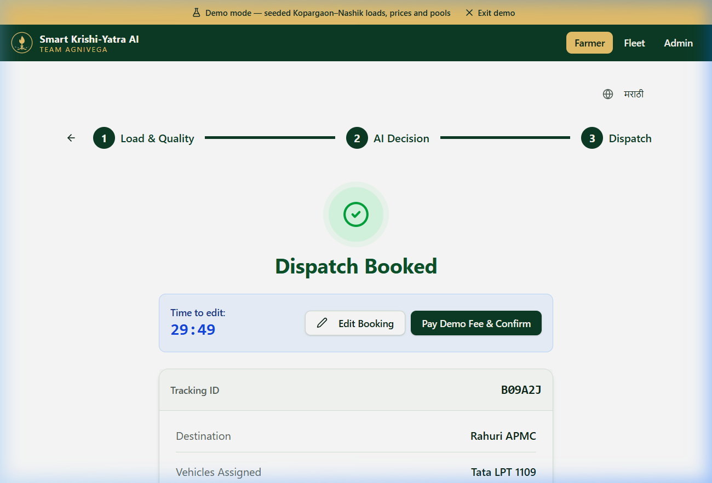
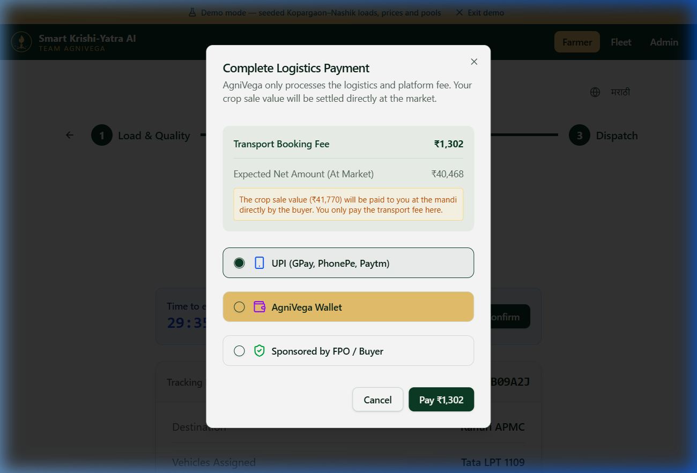
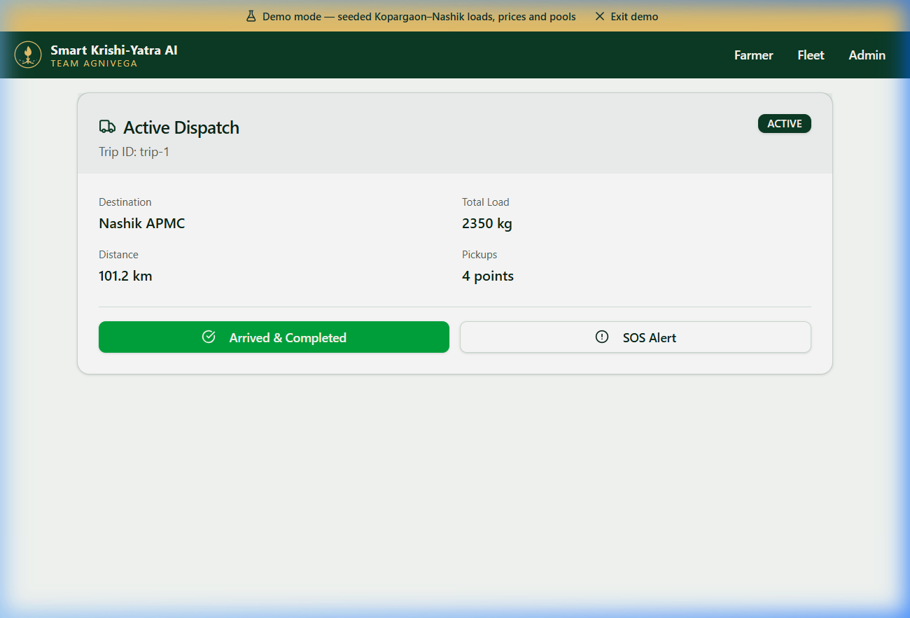
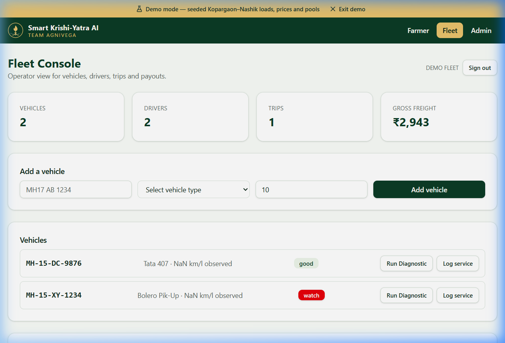
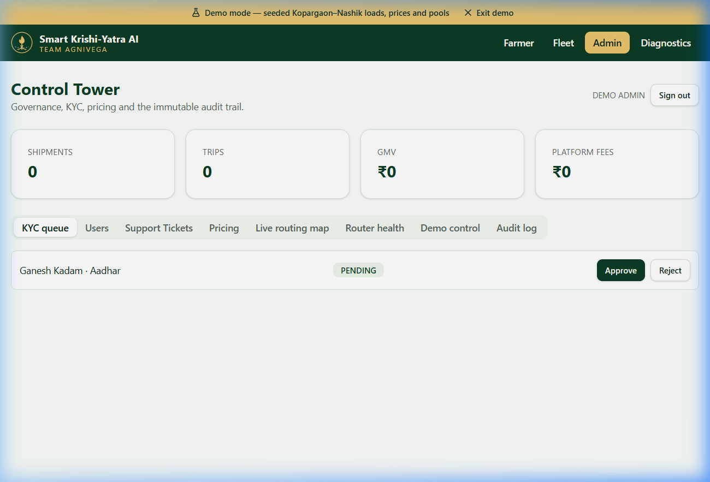

<div align="center">
  

  <h1 align="center">AgniVega</h1>

  <p align="center">
    <strong>An agricultural logistics operating system that unites market intelligence, capacity pooling, and routing to guarantee the highest net return for farmers.</strong>
  </p>

  <p align="center">
    <a href="http://localhost:8080/auth"><strong>Live Demo</strong></a> · 
    <a href="https://github.com/vignesh06-OG/AgniVega-Round2-Demo"><strong>GitHub</strong></a> · 
    <a href="./docs/ARCHITECTURE.md"><strong>Documentation</strong></a>
  </p>

  <p align="center">
    
    
    
  </p>
</div>

---

## 1. The Problem

The traditional agricultural supply chain is operationally blind. 
Farmers rely entirely on **gross mandi prices** when deciding where to sell, completely ignoring the invisible costs that eat their profits:
- Fragmented, un-pooled transport costing up to 40% more.
- Poor vehicle capacity utilization (trucks driving half-empty).
- Spoilage risk due to unknown delays and APMC gate queues.
- A complete lack of visibility after the truck leaves the farm.

**The result:** A farmer might choose a market 50km away because the price is ₹2 higher, only to lose ₹5 in transport and spoilage.

## 2. What AgniVega Actually Does

AgniVega orchestrates the entire decision-to-dispatch loop in one platform. We shift the farmer's decision from "highest gross price" to **"highest expected net amount in bank."**



This is **not** just a truck booking app or a mandi price aggregator. It is a closed-loop operating system where market economics directly control logistics dispatch.

## 3. Why This Is Different

| Traditional Approach | AgniVega Operating System |
|---|---|
| **Gross mandi price** | **Expected net amount** |
| Manual truck search | Capacity-aware vehicle allocation |
| Single truck assumption | Multi-vehicle dispatch pooling |
| Static destination | Market comparison + farmer override |
| Unknown transport cost | Logistics cost breakdown upfront |
| No booking protection | 30-minute editable capacity hold |
| No visibility | Dispatch + simulated live tracking |
| Driver contact sharing | Platform-mediated operational communication |

---

## 4. Product Walkthrough

### 🚜 1. The Farmer Workflow

<div align="center">
  
  
  <p><em>(Left) The bilingual farmer dashboard. (Right) Touch-friendly, icon-based crop selection covering 21 crops—no complex dropdowns required.</em></p>
</div>

<div align="center">
  
  
  <p><em>(Left) Quality analysis with an honest manual fallback when AI API is unavailable. (Right) Market comparison explicitly calculating the Expected Net Amount and hiding complex "ENR" jargon.</em></p>
</div>

### 📦 2. Capacity & Payment

<div align="center">
  
  
  <p><em>(Left) A 30-minute booking hold locking in fleet capacity. (Right) Payment modal clearly separating the Logistics Transport Fee from the Expected Crop Value.</em></p>
</div>

### 🚚 3. Dispatch & Fleet

<div align="center">
  
  
  <p><em>(Left) Driver dashboard showing assigned pooled loads and distances. (Right) Fleet console for capacity and diagnostic management.</em></p>
</div>

### 🏢 4. Admin Control Tower

<div align="center">
  
  <p><em>Control tower for macro-visibility, KYC governance, and live shipment tracking.</em></p>
</div>

---

## 5. Technical Documentation

AgniVega is an offline-capable, SSR-based logistics application utilizing TanStack Start. 
Dive deep into our engineering architecture and logic:

- [Architecture & Tech Stack](./docs/ARCHITECTURE.md)
- [Decision & Pricing Engine](./docs/DECISION_ENGINE.md)
- [Booking State Machine](./docs/BOOKING_STATE_MACHINE.md)
- [Multi-Vehicle Dispatch Logic](./docs/MULTI_VEHICLE_DISPATCH.md)
- [AI Transparency (Live vs. Simulated)](./docs/AI_TRANSPARENCY.md)
- [Testing Strategy](./docs/TESTING.md)
- [Security & Role Isolation](./SECURITY.md)

## 6. Setup & Installation

Getting the product running is dead simple.

```bash
git clone https://github.com/vignesh06-OG/AgniVega-Round2-Demo.git
cd AgniVega-Round2-Demo
npm install
npm run dev
```

### Environment Variables
Copy the `.env.example` file to `.env` and fill in the placeholders (optional for fallback mode):
```bash
cp .env.example .env
```

## 7. Feature Matrix

| Capability | Status |
|---|---|
| Farmer booking workflow | ✅ |
| Bilingual Crop catalogue (21 crops) | ✅ |
| Quality analysis (AI / Manual fallback) | ✅ |
| Market comparison (Net amount calc) | ✅ |
| Multi-vehicle dispatch matching | ✅ |
| Vehicle capacity constraints | ✅ |
| 30-min Booking hold | ✅ |
| Logistics Payment | ✅ |
| Tracking & Dashboard updates | ✅ |
| Driver route dashboard | ✅ |
| Fleet capacity dashboard | ✅ |
| Admin control tower | ✅ |
| Strict Role Isolation | ✅ |

## 🚀 8. Live Demo Golden Path

Test the product yourself at `http://localhost:8080/auth`. 

1. **Login as Farmer** (Click the "Farmer" button).
2. Click **New AI Dispatch**.
3. Select **Soybean** and enter `12000` kg (to trigger multi-vehicle allocation).
4. Fill out quality parameters and proceed.
5. Review the **Market Comparison** and see how the transport fee dictates the highest net return.
6. Select a market and observe the **Vehicle Allocation** split the 12,000kg load across multiple trucks.
7. Confirm the **Booking Hold** (starts a 30-minute timer).
8. Complete the **Payment**.
9. Verify the confirmed booking on your dashboard.
10. Logout, and login as **Driver** to see the active dispatch!
