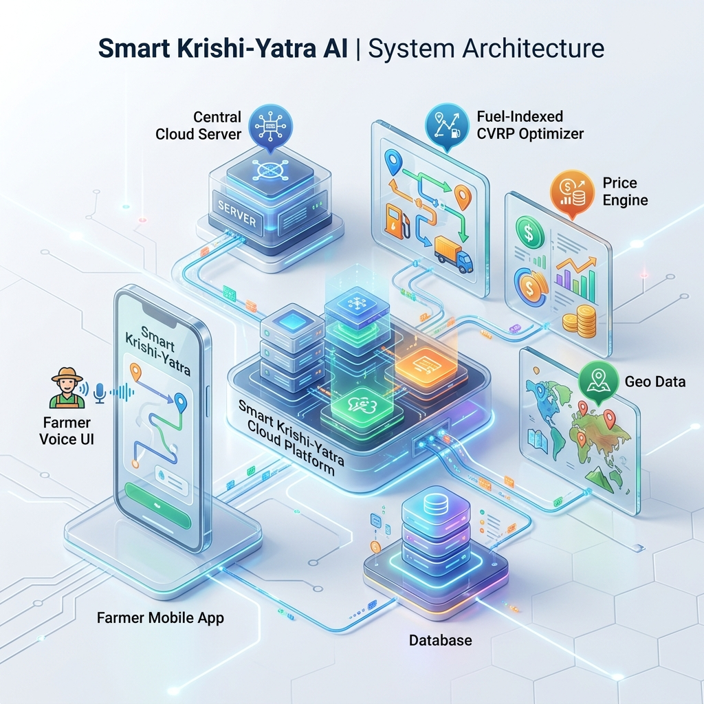
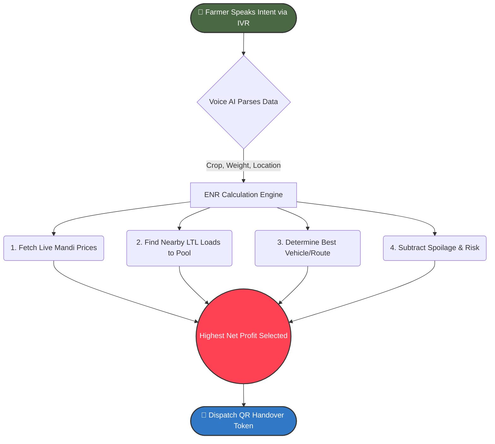

<div align="center">
  

  <h1 align="center">Smart Krishi-Yatra AI</h1>

  <p align="center">
    <strong>Market-Aware Agricultural Logistics Operating System</strong><br/>
    Built for Maharashtra's smallholder farmers to maximize <strong>Expected Net Realization</strong>.
  </p>

  <p align="center">
    <a href="https://github.com/takshalchaudhari/AgniVega"></a>
    <a href="https://react.dev"></a>
    <a href="https://www.typescriptlang.org/"></a>
    <a href="https://tanstack.com/router/latest"></a>
  </p>
</div>

---

<div align="center">
  <h3><em>The highest mandi price is NOT necessarily the highest farmer realization.</em></h3>
</div>

If a farmer chases a high price far away, the transport cost and spoilage risk might wipe out their profits. Our system determines **WHERE, WHEN, and HOW** a farmer should transport their produce to ensure they take home the most money.

---

## 🚀 The Innovation: Expected Net Realization (ENR)

Our system replaces fragmented guesswork with a unified economic calculation:

> **MARKET + TRANSPORT + TIME + QUALITY + RISK → EXPECTED NET REALIZATION**

<details open>
<summary><b>🔍 Click to Expand: How ENR is Calculated</b></summary>
<br>

1. **Market Price Prediction:** We pull real-time crop pricing across mandis.
2. **Deterministic CVRP Optimizer:** We calculate the freight cost by pooling neighboring farmers' loads to distribute freight costs efficiently.
3. **Transit & Queue Modeling:** We calculate dynamic transit times considering toll delays and APMC gate queues.
4. **Spoilage Risk:** We dynamically discount expected payout if a perishable crop approaches its spoilage threshold during transit.

</details>

---

## 🏗️ 3D System Architecture

<div align="center">
  
</div>

<details>
<summary><b>⚙️ Click to Expand: Technical Stack Details</b></summary>
<br>

The platform operates using a tiered, offline-capable architecture suitable for rural connectivity environments.

- **Frontend:** PWA built with React 19, TypeScript, and Vite.
- **State Management:** TanStack Query & Router for robust, offline-tolerant data caching.
- **Styling:** Tailwind CSS & Radix UI primitives with a modern glassmorphic 3D design system.
- **Routing Engine (Tiered):**
  1.  _Tier 1 (Preferred)_: OSRM (Open Source Routing Machine) over network for precise road distance.
  2.  _Tier 2 (Fallback)_: Offline deterministic geospatial approximation (Haversine formula).
- **Backend / Calculation Engine:** Server Functions via TanStack Start, executing complex routing and economic math without heavy client-side processing.

</details>

---

## 🔄 Interactive Flow: How It Works



---

## 📦 Installation & Setup

1. **Clone the repository:**

   ```bash
   git clone https://github.com/takshalchaudhari/AgniVega.git
   cd AgniVega
   ```

2. **Install dependencies:**

   ```bash
   npm install
   ```

3. **Start the Development Server:**
   ```bash
   npm run dev
   ```
   _The application will run on `http://localhost:5173`._

---

## 🌐 Demo Scenarios & Features

### 1. Farmer Portal

Farmers can input their crop, weight, and location. The engine instantly computes pooled transport options, evaluates spoilage risk, and ranks the output strictly by net realization.

### 2. Admin Scenario Injection

Logistics is volatile. Administrators can inject real-time delays (e.g., highway closures, vehicle breakdowns) into the system. The platform reacts by instantly recalculating transit times, escalating spoilage risks, and re-ranking the best mandi for the farmer to avert total loss.

---

## 📜 Disclaimer & Legal

- The routing algorithms provided in this prototype are based on a **Deterministic CVRP-based demonstration optimizer** using nearest-neighbor and 2-opt heuristics.
- Please review our [Privacy Policy](./PRIVACY_POLICY.md) and [Terms of Service](./TERMS_OF_SERVICE.md) for data handling specifics.

## 📄 License & Third-Party Code

See [THIRD-PARTY-NOTICES.md](./THIRD-PARTY-NOTICES.md) for details on the open-source libraries, UI components, and geospatial systems used in this project.
