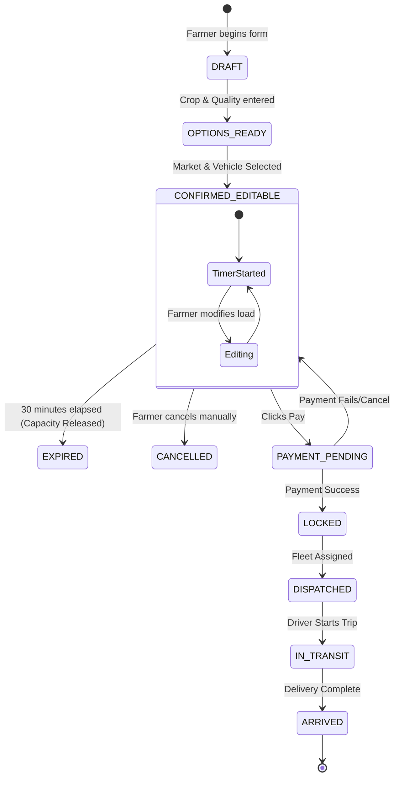

# Booking State Machine

AgniVega manages the lifecycle of a farmer's dispatch through a strict state machine to prevent capacity overallocation.

## State Diagram

## Key Mechanics
1. **30-Minute Hold**: When a farmer selects a market and holds a booking, the required vehicle capacity is temporarily reserved. A 30-minute timer starts.
2. **Capacity Release**: If the booking expires or is cancelled, that capacity is immediately returned to the fleet pool.
3. **LOCKED**: Once payment is confirmed, the booking is permanently locked and passed to the Driver dashboard for dispatch.
